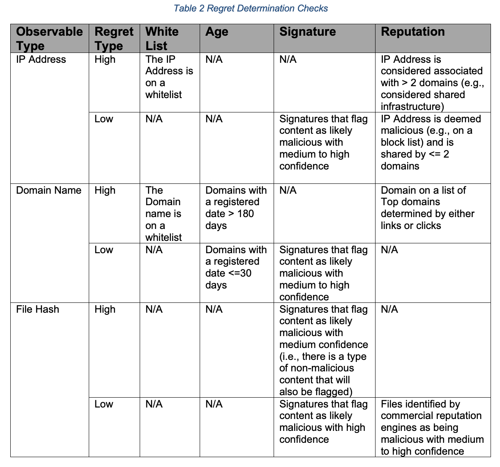
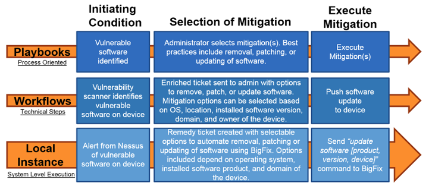

# Low-Regret Methodology for Evaluating Cyber Threat Intelligence to Enable Network Defense

Table of Contents
=================

 * [Introduction](#introduction)
   + [Using Low-Regret Scoring for IOCs to enhance their value](#using-low-regret-scoring-for-iocs-to-enhance-their-value)
   + [Introduction to workflows](#introduction-to-workflows)
 * [Examples of employing Low-Regret via Orchestrated Workflows](#examples-of-employing-low-regret-via-orchestrated-workflows)
 * [Summary](#summary)
 * [Acknowledgement](#acknowledgement)
 * [Disclaimer](#disclaimer)
 * [License](#license)

## Introduction

There are many sources of cyber threat intelligence available to network defenders today. 
However, these feeds often result in very little tactical utility for network defense 
because of poor data quality, and limited ability to rapidly screen information to 
identify the pertinent pieces of information and what to do with it.

In order to transform the utility of cyber threat intelligence so that it will enable 
network defense, automation is needed. However, many organizations are uncomfortable with 
blindly taking automated actions that can impact the network. They traditionally have 
operations personnel review or approve response actions before execution. 

Many of these same organizations trust their vendors (such as anti-virus) to take the 
same actions on their behalf without any insight into the information or decision process 
used or the action implemented. There are many reasons for this inconsistency, in part, 
it is because the local risk vs. reward analysis favors letting the vendor take the 
action.

We would recommend using a benefit vs. regret process to make decisions about 
implementing automated actions. The idea is that organizations should focus on when to 
take an action in an automated manner instead of whether the action should be automated. 
With respect to automated response based on cyber threat intelligence, the definition of 
regret can be simply defined as:

- **Low-Regret**: Taking automated action against this intelligence is extremely unlikely 
to disrupt operations, regardless of whether or not the intelligence assessment is 
correct (e.g., automatically blocking a domain that is fairly new and has never had 
any connection attempts in the organization’s history).
- **High-Regret**: Taking automated action against this intelligence may have impact to 
operations (e.g., automatically blocking an IP address that is on shared cloud 
infrastructure and has recently resolved to a domain frequently used by the organization 
or by one of its tools/services)

In the above definition, it is important to note that the determination of whether or not 
the threat assessment of the intelligence is correct is not a factor in determining 
regret. Often, the time required to make a complete determination about whether a threat 
is actually malicious negates the value of the intelligence. For example, a domain may 
very well be a Command and Control (C2) center for a malware campaign, but by the time a 
reputation score is available, that domain is now inactive and the attacker has moved on. 
If that same domain met the Low-Regret criteria, it could be automatically blocked, 
disrupting the attacker’s infrastructure, and have no impact to operations except that a 
potential threat was mitigated. 

JHU/APL has piloted threat intelligence feeds using a Low-Regret scoring methodology in 
multiple critical infrastructure communities. It is important to note that the initial 
set of data being processed was derived from sources that were designed to identify or 
investigate unauthorized or malicious behavior. In those environments, approximately 1/3 
of all threat intelligence can automatically be evaluated as low-regret within seconds of 
initial receipt via automation. This greatly reduces the set of data that must be 
analyzed and provides a wealth of data in a timeline that is actionable by network 
defenders. These feeds have demonstrated value for Security Operations as well as Threat 
Intelligence whereas legacy threat intelligence feeds have only provided actionable 
utility to Threat Intelligence teams alone (when an organization has such a team).

This is not to say that determining maliciousness of threat intelligence is not 
important. In fact, it is crucial for High-Regret intelligence. By automatically 
responding to the Low-Regret intelligence, an organization can now focus its precious 
human resources on making the required risk determinations on potentially compromised 
systems that can impact operations.

This paper will provide an overview of how to specifically apply Low-Regret scoring to 
Indicators of Compromise (IOCs) in order to support automated network defense. Several 
sample workflows based on recent JHU/APL production pilots will also be provided as a 
reference implementation to aid any organization interested in using a similar approach 
to their own Cyber Threat Intelligence.

### 	Using Low-Regret Scoring for IOCs to enhance their value

One way to make threat intelligence more consumable is to provide a score that conveys 
context essential to decision making in a consistent and transparent manner.  With that 
in mind, the scoring system defined in Table 1 was developed for IOCs. These IOCs can be 
extracted from Intrusion Detection/Prevention Systems (IDS/IPS), or other threat feeds. 
It is JHU/APL’s vision that a scoring system like this can be applied to a circle of 
trust group sharing IOCs amongst themselves via a third party or within an organization’s 
threat intelligence capability if one exists.

At the heart of this scoring methodology is the ability to determine if an IOC is high 
or low regret. This determination is being performed in a completely automated manner. 
A very conservative set of checks were implemented and are listed in Table 2. More 
characteristics were considered, but only those that required information consistently 
available in an automated fashion using existing or free resources were selected. 
Reputation services or other enrichment sources were not used for the JHU/APL effort, 
but organizations can easily add in these types of checks as appropriate. 

`If an organization chooses to utilize these reputation sources, it is recommended to 
verify that the number of potential IOCs from your sources will not exceed licensing 
restrictions once automation is in place.`

The term signature is used loosely to mean any rule, signature, score, etc., that content 
is evaluated against to determine whether something is suspicious or potentially 
malicious. It is the value or condition identified by the source that can be compared to 
a set of rules to determine if the IOCs in the content should be considered for scoring 
as well as help determine high or low regret. 

This is important because it is directly related to the benefit vs. regret analysis that 
local organizations perform. In certain cases, like malware, responding provides a direct 
benefit and no regret. In an effort to share IOCs related to previously unknown threats, 
there is a need to first ensure a certain amount of benefit will be gained by taking 
action and that is how the alert signature is used. Then the remaining IOCs are scored 
using the low-regret processing to identify those that fall into the acceptable area of 
benefit vs. regret.  

In JHU/APL’s effort, signature checks were primarily used to filter the initial data set 
to identify IOCs that were most likely not high regret in an automated manner. They were 
also used to determine if certain IOCs were low regret. Signature false positive rates 
should be used to determine if they are accurate or authoritative enough to correlate to 
a specific regret score. Combinations of signatures, their error rates, as well as what 
conditions result in what type of errors can be combined to filter the data set into IOCs 
that are most likely to be high or low regret. This type of filtering can help make the 
scoring process more reliable, meaningful, or cost-effective.

### Introduction to workflows
Many organizations are looking to implement automation and orchestration via products 
such as Security Orchestration, Analysis, and Response (SOAR) platforms. However, a SOAR 
vendor's capabilities can be misaligned with an organization's policies and procedures.  
To help establish this connection, JHU/APL has identified three levels of abstraction 
for use by an organization:

- Playbooks (Process Oriented)
  - Represents a general security process at most basic level
    - Can be mapped to governance or regulatory requirements
    - Identifies Industry best practices for steps in the process
    - Designed to be human readable
- Workflows (Technical Steps)
  - Implements an organizational playbook
    - Is repeatable and auditable 
    - Can tailor the amount of automation depending on the needs and capabilities of the system and the desires of the organization 
    - Is machine-to-machine sharable 
- Local Instances of Workflows (Execution at System Level)
  - Is often thought of as a “run book” or “SOAR playbook”
  - Orchestrates and executes a workflow's actions in a manner that:
    - Is consistent with local policies, procedures, thresholds, and decision process 
    - Incorporates technologies, products, and assets deployed in the local environment 
    - Responds to conditions or events that are occurring in the local environment 

The following figure provides a comparison between these types of abstraction.

This report provides examples of workflows to help multiple organizations understand how 
to implement security automation and orchestration if they have not done so before. These 
workflows are represented using Business Process Modeling Notation (BPMN). This is a 
standard for workflows that allows for representation of the process without requiring 
specific technologies. There are multiple free and non-free applications for editing and 
reading files in the BPMN format (e.g., Camunda Modeler, Flowable Modeler, etc.). While 
visual representations are provided in this report, JHU/APL will also make the XML 
based “.bpmn” files available for download as well. The following figure provides a 
style reference of the BPMN elements used in the workflows provided in this report.

## Examples of employing Low-Regret via Orchestrated Workflows

The JHU/APL team collaborated with multiple organizations to develop automation and 
orchestration workflows to support the use cases addressed in this report. These 
workflows were inherently tied to specific technologies for each partner environment. 
Due to this constraint, the orchestrator workflows by themselves are not immediately 
usable by other organizations and can require heavy modification if one changes their 
security technology stack.

To address this issue, multiple examples of BPMN workflows are presented to showcase 
the different ways that one could approach the challenges within the use case.  In this 
section, we will present the general process required to create, score, and disseminate 
IOCs via automation and orchestration. The following figure shows the high-level end to 
end scoring and dissemination process being implemented. 

This process involves:
1.	Polling multiple information sources
2.	Extracting potential IOCs
3.	Determining if the IOC needs to be scored
4.	Performing regret determination
5.	Assigning associated scores
6.	Generating the STIX message
7.	Posting the STIX message to the TAXII server for dissemination

The following figure shows the Parsing workflow in more detail, which implements steps 
1-3. The workflow can be initiated in one of two ways: based on elapsed time and polling 
a source or a trigger is provided by a source to indicate new content. A previously 
scored IOC will go through the regret determination process again if it: a) comes from 
a new source or b) it has been 7 days since it was last scored. The different sources 
have different levels of accuracy and provide different context when identifying IOCs, 
so when a new source has findings for a previously seen observable, the score may be 
different once the new information is processed by the Regret Determination workflow.

The reason to reevaluate after 7 days is to prevent consumer organizations from aging off 
IOCs that are still in use. Most IOCs are associated with malware Command and Control 
(C2) infrastructure and have a very short half-life. Many products and operations will 
implement a process to undo response actions (e.g., remove firewall block) for IOCs that 
are 7-30 days old. For that reason, IOCs seen after 7 days from previous scoring will be 
either reevaluated or resent with a new valid_until value in the STIX message.

IOCs that have been previously scored as a 3 or 4 will not be rescored, only resent. If 
the previous score was less than 3, the IOC will go through the regret determination and 
scoring process again. An organization can determine if they want to add in more complex 
logic for reevaluating IOCs that were previously considered analyst vetted or validated.

The following figure documents the Regret Determination workflow for an IP Address. The 
first step is to check the IP Address against a whitelist. Analysts have different levels 
of confidence in the signature accuracy for difference sources. Therefore, for high 
confidence sources, the signature itself can be used to determine if an IP Address is 
low-regret. For all other sources, the signature checks are used to filter the IP 
Addresses that should be checked against the block list. If an IP Address is on the block 
list, another check is performed to determine how many domains are associated with that 
IP. Only if the number of domains is <=2 is the IP Address then marked as low regret.

The following figure documents the Regret Determination workflow for a domain. Any domain 
from any source that was registered less than 30 days ago is determined to be low regret.

The following figures document the Regret Determination workflow for a file hash or email 
respectively. 

File Hash Workflow:

Email Workflow:

The following figure documents the STIX Generation and Sharing workflow, which includes 
steps 6 and 7 highlighted in the discussion of the high-level process.

The following figure represents the two processes that occur after an analyst has 
completed evaluation of any alert, message, or other content that contained an IOC. The 
first process is triggered when the conditions are met that an IOC is to be considered 
analyst vetted. IOCs determined to be low regret and previously shared as a 2 are 
rescored as a 3 and resent.

The second process is triggered when and IOC meets the conditions to be considered 
analyst validated. These IOCs are rescored as a 4 and resent.

The following figure is a Revocation workflow. This workflow is meant to correct scores 
for IOCs that are inaccurately marked as low-regret. This can occur because the content 
that the IOC is associated with has been deemed to be a false-positive or because a 
decision has been made to revoke the IOC. 

## Summary

Organizations already implement automated response actions on their networks. Most of the 
time, these actions are performed by vendor products or services in response to confirmed 
risks in a manner that is accepted by regulators, experts, and peers. These are 
considered low-regret actions when taken to mitigate high-priority threats. As 
organizations look to implement automated actions in response to alerts, events, or new 
information; the use of a Benefit-Regret decision process can help determine the areas 
where automated responses are most helpful or conversely, least risky. Focusing on 
identification of low-regret actions, even with uncertainty about the risk, can improve 
the efficiency of operations personnel and tremendously scale up appropriate automation 
of response actions.

For more information, please contact the primary Author, Kimberly Watson, 
Kimberly.Watson@jhuapl.edu 

## Acknowledgement

This material is based upon work supported by the U.S. Department of Homeland Security / 
Cybersecurity & Infrastructure Security Agency under Grant Award Number 
DHS-19-CISA-128-SLT-001 State, Local, Tribal and Territorial Indicators of 
Compromise Automation Pilot.

## Disclaimer

The views and conclusions contained in this document are those of the authors and should 
not be interpreted as necessarily representing the official policies, either expressed 
or implied, of the U.S. Department of Homeland Security / Cybersecurity & Infrastructure 
Security Agency.

## License

 This work is licensed by Johns Hopkins Applied Physics Laboratory under a Creative
Commons Attribution 4.0 International License.
